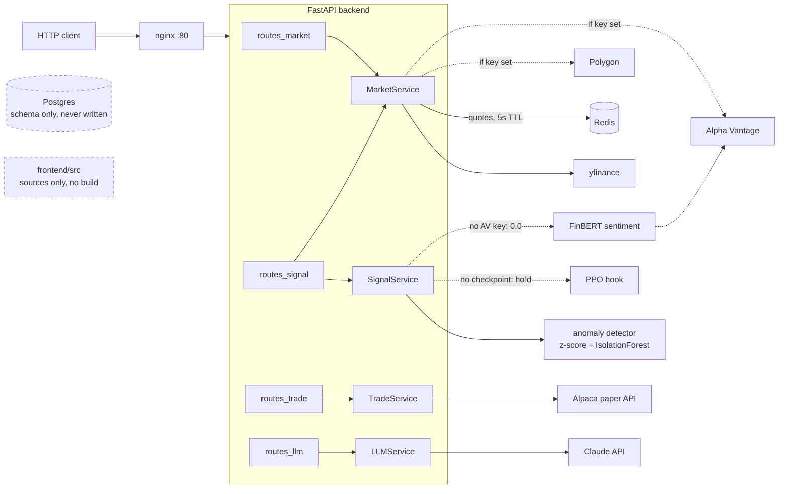

# Quant

Quant is an MVP scaffold for a personal trading dashboard: a FastAPI backend that serves
market data, computes a **heuristic** trading signal, asks Claude for commentary, and can
submit orders to an **Alpaca paper account**. It is not a production system, it contains no
validated alpha, and nothing in it should be pointed at real money.

This branch (v0.2) exists to make the repo's claims match its code. The full gap analysis of
v0.1 is in [`docs/audit.md`](docs/audit.md); code that was never wired into anything now
lives in [`experimental/`](experimental/README.md) with its defects labeled.

## Status

**Implemented and working**

- FastAPI service: market data (yfinance always; Polygon and Alpha Vantage when keys are
  set), a heuristic signal endpoint, Claude-backed `/analyze` and `/explain`, and Alpaca
  paper-trading calls behind a `confirmed=true` flag.
- Redis caching for `/quote` only (5-second TTL). History calls are uncached.
- Anomaly damping: a z-score of the latest close against the 3-month mean, plus an
  IsolationForest refit per request on price levels. Note the consequence: fresh 3-month
  highs and lows are flagged as "anomalous" by construction.

**Wired but inert by default**

- FinBERT sentiment runs only if `ALPHA_VANTAGE_API_KEY` is set (headlines come from Alpha
  Vantage news). Without it the sentiment term is silently `0.0`.
- A PPO hook loads `ml/models/checkpoints/ppo_agent.zip` if present. No checkpoint ships
  with the repo, so the RL vote is always `hold`. The only training script for it lives in
  `experimental/` because it trains on synthetic data.
- Both dependencies load lazily: a keyless deployment never imports torch, transformers, or
  stable-baselines3.

**Experimental — quarantined, unvalidated, not in any working path**

- Everything in [`experimental/`](experimental/README.md): LSTM/Transformer definitions
  (never trained on real data), a feature pipeline with zero call sites, an RL training
  script that fits a synthetic random walk, and the old 14-line backtest with no cost model.

**Not built**

- Authentication of any kind. Every endpoint, including `/trade/execute`, is open.
- Pre-trade risk checks. See the warning below.
- Persistence. A Postgres schema and Alembic migration exist; no application code reads or
  writes them.
- A runnable frontend. `frontend/src/` holds React component sources only — there is no
  `package.json`, lockfile, or build config, so it cannot be installed or started. Its
  WebSocket hook targets an endpoint the backend does not have.
- Trained models. No checkpoint of any kind is shipped.

## ⚠️ Trading safety

`POST /api/trade/execute` submits a **market order to Alpaca** after checking exactly one
thing: a `confirmed` boolean. There are no buying-power, position-limit, order-size, symbol,
or duplicate-submission checks, and no market-hours handling. The `stop_loss` value in the
response is **informational only — no stop order is ever placed**. The default
`ALPACA_BASE_URL` is the paper endpoint; do not point this code at a live account.

## Architecture



### What the signal actually is

`SignalService.predict` computes, from ~3 months of daily closes:

```
momentum = close[-1] / close[-5] - 1            # return over the last 4 sessions
score    = 0.4·tanh(3·momentum) + 0.3·sentiment + 0.3·rl_vote
score    = score / 2 if anomaly flagged
signal   = BUY if score > 0.2, SELL if score < -0.2, else HOLD
```

`confidence` is `clip(|score|, 0.5, 0.99)` — a clamped score magnitude, **not** a calibrated
probability. In the default keyless deployment, sentiment and rl_vote are both 0, so the
system reduces to a momentum threshold that emits BUY/SELL only when the 4-session return
exceeds ±18.3% — in practice, it says HOLD. The `momentum_projection` field in the response
is `close · (1 + 0.2·momentum)`, plain arithmetic (it was misleadingly named
`lstm_prediction` in v0.1).

No claim is made that this signal has predictive value. It has never been backtested.

## API endpoints

| Endpoint | What it does |
|---|---|
| `GET /api/prices/{ticker}` | 30 days of candles (Polygon if keyed, else yfinance) + Alpha Vantage fundamentals if keyed |
| `GET /api/quote/{ticker}` | Latest price; Redis-cached 5 s |
| `GET /api/history/{ticker}` | yfinance OHLCV (auto-adjusted) |
| `POST /api/signal/predict` | The heuristic signal above |
| `GET /api/anomaly/{ticker}` | Runs the full signal pipeline, returns only the anomaly flags |
| `POST /api/trade/execute` | Alpaca market order — read the safety warning |
| `GET /api/portfolio` | Alpaca account equity, cash, positions |
| `POST /api/analyze` | Claude commentary on a signal payload |
| `POST /api/explain` | Claude commentary on an arbitrary client-supplied context dict |

Errors are not normalized: any upstream failure (yfinance, Redis, Alpaca, Anthropic)
surfaces as an unhandled 500.

## Setup

Backend, locally (Python 3.11+):

```bash
python -m venv .venv
.venv/Scripts/activate          # Windows; use .venv/bin/activate on Unix
pip install -r requirements.txt
cp .env.example .env            # then fill in the keys you have
uvicorn backend.main:app --reload
```

Notes:

- `POSTGRES_URL` and `REDIS_URL` must be set (the settings model requires them), but
  Postgres is never contacted and Redis only on `/quote`. The `.env.example` values satisfy
  boot.
- With no API keys, the service runs: signals degrade as described above, `/trade` and
  `/analyze` fail at call time.
- `docker-compose` (in `infra/`) starts api + redis + postgres + nginx, but pip-installs the
  full requirements on every container start and injects `.env.example` (empty keys) as the
  environment. The `frontend` service cannot start (no `package.json`). Treat compose as a
  sketch, not a deployment.

## Environment variables

| Variable | Needed for | Source |
|---|---|---|
| `POSTGRES_URL`, `REDIS_URL` | Boot (required by settings); Redis used by `/quote` | `.env.example` defaults work locally |
| `POLYGON_API_KEY` | Optional quotes/candles upgrade | polygon.io |
| `ALPHA_VANTAGE_API_KEY` | Fundamentals + news headlines (enables FinBERT sentiment) | alphavantage.co |
| `ALPACA_API_KEY`, `ALPACA_SECRET_KEY`, `ALPACA_BASE_URL` | `/trade`, `/portfolio` — keep the paper URL | alpaca.markets |
| `ANTHROPIC_API_KEY`, `CLAUDE_MODEL` | `/analyze`, `/explain` | console.anthropic.com |

## Tests

There is no test suite on `main` yet. This branch adds pytest, ruff, CI, and a cost-aware
baseline backtest — sections below will be filled in as they land on the branch.

## v0.2 roadmap (this branch)

1. ~~Audit claims vs. code~~ → [`docs/audit.md`](docs/audit.md)
2. ~~Quarantine unwired model code~~ → [`experimental/`](experimental/README.md)
3. ~~This README~~
4. Packaging (`pyproject.toml`), ruff, pytest, deterministic seeds, GitHub Actions CI
5. A `quant/` research package: buy-and-hold and moving-average-crossover baselines through
   a backtest that charges commissions, spread, and slippage, executes with a one-day delay,
   and reports out-of-sample Sharpe, max drawdown, turnover, and total return against SPY
6. Tests for backtest accounting, signal calculation, and portfolio math
