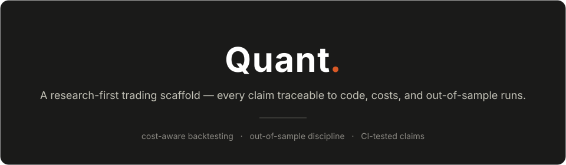
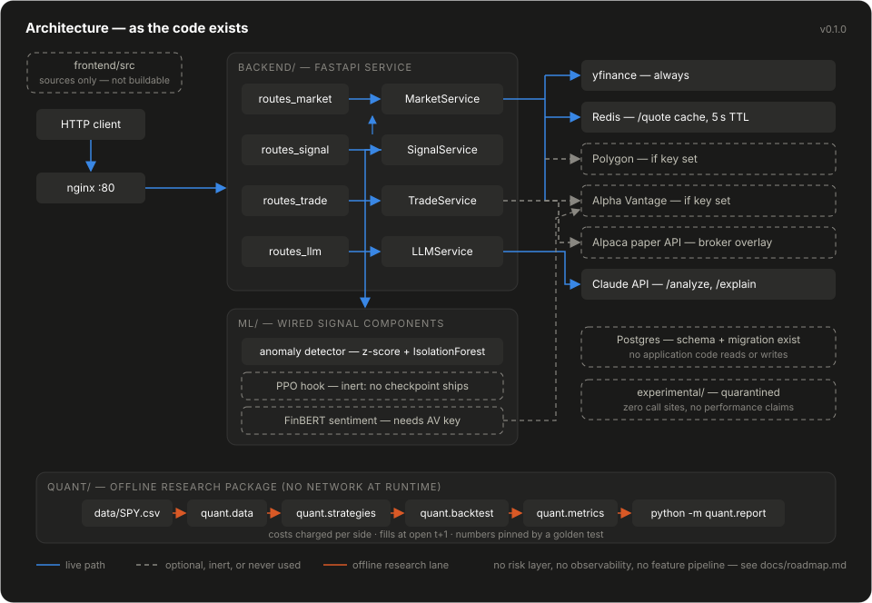
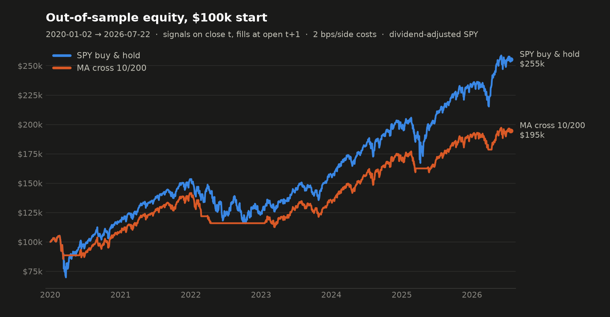

# Quant

Research-first quantitative trading scaffold: a cost-aware, out-of-sample backtesting lane
and a FastAPI market-data/signal service, with every claim pinned to code, tests, or a
reproducible run.

<p align="center">
  
</p>

<p align="center">
  <a href="https://github.com/MohammedAlkindi/Quant/actions/workflows/ci.yml"></a>
  <a href="pyproject.toml"></a>
  <a href="https://github.com/astral-sh/ruff"></a>
  <a href="LICENSE"></a>
</p>

## The problem this solves

Personal trading repos routinely claim what their code cannot do — "LSTM forecasting" that
never runs, backtests with no costs, "production-ready" over zero tests. This repo's own
v0.1 failed that bar, and the full audit is committed at [`docs/audit.md`](docs/audit.md)
rather than hidden.

v0.1.0 inverts the deal. The base layer is honest and verifiable: a backtest engine that
charges costs and executes with a one-bar delay, reported numbers pinned to committed data
by a golden test, a service that documents exactly what its heuristic computes, and
unvalidated code quarantined where it cannot leak claims. Strategy research can start from
ground truth instead of aspiration.

## Architecture

<p align="center">
  
</p>

Three lanes and a quarantine. `backend/` serves market data, a documented heuristic
signal, Claude commentary, and Alpaca paper-trade calls — it boots keyless, and heavy SDKs
(torch, transformers, the broker SDK) are lazy opt-in overlays. `quant/` is the offline
research lane: vendored data → strategies → cost-aware engine → metrics → report,
deterministic end to end. `ml/` holds the components genuinely wired into the signal;
`experimental/` holds everything that is not, [labeled with its
defects](experimental/README.md).

Module boundaries, the signal formula, the endpoint table, and environment variables:
[`docs/architecture.md`](docs/architecture.md).

## Quickstart

From a clean clone, no API keys required:

```bash
git clone https://github.com/MohammedAlkindi/Quant.git && cd Quant
python -m venv .venv
.venv/Scripts/activate            # Windows; use .venv/bin/activate on Unix
pip install -r requirements.txt   # core API deps
pip install -e ".[dev]"           # quant research package + pytest + ruff + matplotlib
cp .env.example .env              # empty keys are fine — the service boots keyless

uvicorn backend.main:app --reload # http://127.0.0.1:8000/healthz -> {"status":"ok"}
pytest                            # full suite
python -m quant.report            # reproduces the backtest table below, offline
```

With no keys, signals degrade exactly as documented (sentiment 0.0, RL vote `hold`) and
`/trade` + `/analyze` fail at call time. Optional overlays:
[`requirements-ml.txt`](requirements-ml.txt) enables FinBERT/PPO;
[`requirements-broker.txt`](requirements-broker.txt) enables the Alpaca endpoints (read
its header — the install is deliberately two-step).

## Baseline backtest — out of sample

<p align="center">
  
</p>

Parameters were chosen on 1993–2019 only (3×3 grid by net in-sample Sharpe → 10/200);
2020-01-02 → 2026-07-22 is untouched evaluation data. Signals form on the close, fill at
the **next open**, and pay **2 bps per side** (0.5 commission + 0.5 half-spread + 1.0
slippage). Long-only, unlevered, $100,000 start, dividend-adjusted SPY, Sharpe at rf=0.

| Strategy | Total return | CAGR | Sharpe (rf=0) | Max drawdown | Turnover/yr | Costs paid | Trades |
|---|---|---|---|---|---|---|---|
| SPY buy & hold (benchmark) | +155.26% | +15.44% | 0.81 | −33.72% | 0.10× | $20 | 1 |
| MA crossover 10/200 | +94.60% | +10.74% | 0.83 | −20.51% | 1.88× | $337 | 13 |

Read it straight: the crossover **underperforms buy-and-hold on total return** and wins on
drawdown — the standard trend-following tradeoff. No alpha is claimed; these are the
baselines future work must beat. Methodology, benchmark rationale, limitations, and
reproduction commands: [`docs/backtest.md`](docs/backtest.md). The table is enforced
against the committed data by [`tests/test_report_golden.py`](tests/test_report_golden.py).

A companion pre-registered study asks at what per-side cost nine commonly recommended
retail rules stop beating buy-and-hold — on this window **none survives even at zero
cost**: [`docs/cost-study/results.md`](docs/cost-study/results.md), reproduced offline by
`python -m quant.cost_study`.

## Forward window — beyond the snapshot

The table above ends at the committed snapshot (2026-07-22) and has been looked
at; nothing in it is a forward claim anymore. The forward lane
([`forward/`](forward/README.md)) keeps evaluating the same frozen 10/200
strategy on bars that postdate every committed decision — vendored IBKR daily
bars spliced behind a seam check, same engine, same costs, reproduced by
`python -m quant.forward` and pinned by
[`tests/test_forward_golden.py`](tests/test_forward_golden.py) — beside a
pre-registered, append-only decision log scored by `python -m quant.scoring`.
As of 2026-08-14 the forward window is 16 bars, no cross has fired, and the
crossover has been long throughout: identical to buy-and-hold at +5.31%. A
window that short supports no conclusion; the lane exists to accumulate one.

## Project structure

```
backend/            FastAPI service: routes → services → data clients
ml/                 signal components wired into the API (anomaly, RL hook, FinBERT)
quant/              offline research: loader, strategies, cost-aware engine, metrics, report, cost study
experimental/       quarantined unvalidated code — zero call sites, defects labeled
tests/              engine accounting, portfolio math, signals, golden reproductions
data/SPY.csv        committed adjusted daily history (provenance in docs/backtest.md)
forward/            forward window: vendored IBKR tail, decision log, connector inventory
scripts/            fetch_data.py, plot_equity.py
docs/               audit, architecture, backtest methodology, cost study, roadmap, assets
infra/              docker-compose sketch + nginx config
frontend/           React sources only — not buildable (no package.json)
```

## What this is / what this is not

**This is**

- A verified-honest base for quant research: cost-aware, delayed-execution backtesting
  with out-of-sample discipline, numbers a reader can reproduce offline in one command.
- A keyless-bootable FastAPI service whose signal is documented as the heuristic it is.
- A repo that audits itself: [`docs/audit.md`](docs/audit.md),
  [`experimental/README.md`](experimental/README.md), [`docs/roadmap.md`](docs/roadmap.md).

**This is not**

- **A live trading system. Do not point it at real money.** `/trade/execute` checks
  exactly one thing (`confirmed=true`); there are no buying-power, size, symbol, or
  duplicate-order checks; the `stop_loss` in the response is informational — no stop order
  is ever placed. The default broker URL is Alpaca's paper endpoint. Risk controls are the
  top of the [roadmap](docs/roadmap.md), not a shipped feature.
- An alpha source. The one strategy beyond buy-and-hold is a canonical baseline, and it
  trails the benchmark on total return over the test window (table above).
- A production service — no auth, errors surface as raw 500s, and the Postgres schema has
  no readers or writers yet.
- An ML showcase. No trained model ships; everything unvalidated sits in
  [`experimental/`](experimental/README.md) with its defects listed.

## License

[MIT](LICENSE).
