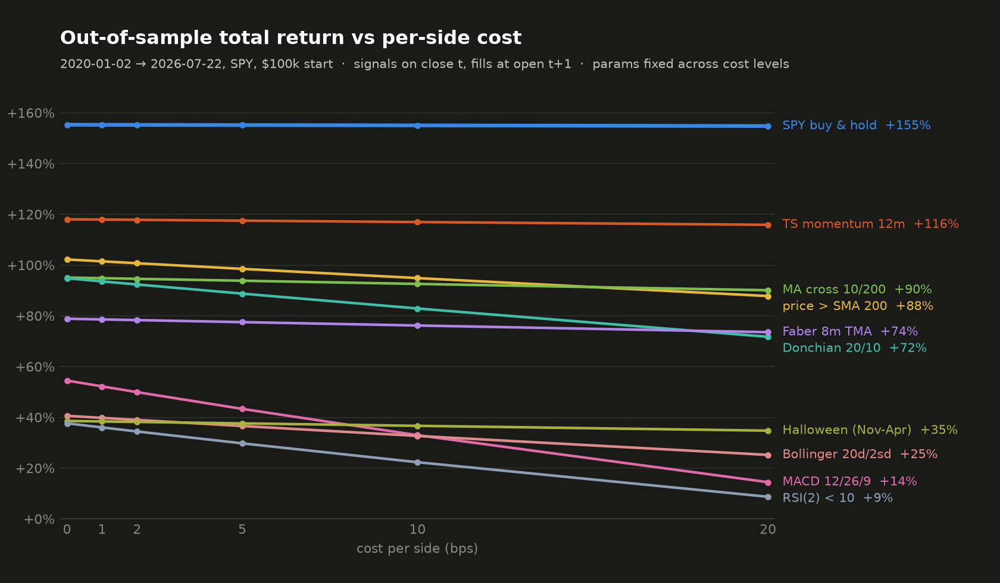

# Cost study — results

Protocol: [`protocol.md`](protocol.md), committed before any grid cell was computed.
Reproduce everything below offline with:

```bash
python -m quant.cost_study
```

Every number here is enforced against `data/SPY.csv` by
[`tests/test_cost_study_golden.py`](../../tests/test_cost_study_golden.py); if the study
or the data changes, that test fails and this file must be regenerated, not hand-edited.

## Headline

**The break-even question has a degenerate answer on this window: none of the nine
commonly recommended rules beats SPY buy-and-hold even at zero transaction cost**
out of sample (2020-01-02 → 2026-07-22). No break-even cost exists anywhere in the
grid, and the pre-registered interpolation clause was never used. Costs are not why
these rules fail here — forgone upside is. Costs only decide *how badly* each one
loses (the high-turnover rules give up a further 15–40 pp between 0 and 20 bps/side).

This is a statement about SPY over one strongly rising window, not about these rules
everywhere. See *Limits*.

<p align="center">
  
</p>

The chart is regenerated from the committed data by
[`scripts/plot_cost_study.py`](../../scripts/plot_cost_study.py), which reads the same
`evaluate_study` output the golden test pins — regeneration is byte-identical.

## Setup (from the protocol, unchanged)

- Engine: `quant.backtest.run_backtest` v0.1.0, unmodified — signal on close *t*, fill
  at open *t+1*, one-way drag in bps of the fill, long-only, unlevered.
- Selection: each strategy's pre-registered grid searched **in-sample only**
  (1993-01-29 → 2019-12-31) by net Sharpe at 2 bps/side; parameters then held fixed
  across all cost levels. Nothing was re-tuned after any result was seen.
- Evaluation: out-of-sample 2020-01-02 → 2026-07-22, $100,000 initial equity, cost
  levels {0, 1, 2, 5, 10, 20} bps per side.
- The 2 bps/side column reproduces the README baseline table exactly (cross-checked by
  the golden test against `tests/test_report_golden.py`'s pins).

Selected parameters (grid winners by net in-sample Sharpe at 2 bps/side):

| Strategy | Selected | Net IS Sharpe | Note |
|---|---|---|---|
| MA cross | 10/200 | 0.80 | Same pick as the README baseline; grid is the practitioner set (incl. 50/200 golden cross), not BLB's exact pairs |
| price > SMA | 200 | 0.65 | The canonical "200-day rule" won its grid; BLB's (1,200) at 0% band — Siegel's version adds a 1% band, not used here |
| Faber TMA | 8 months | 0.82 | The rule picked 8m over Faber's canonical 10m — this row is a neighbor of Faber's rule, not the rule itself |
| TS momentum | 12 months | 0.78 | Canonical 12m won; long/cash absolute-momentum form (Antonacci), not MOP's long/short vol-scaled strategy |
| RSI(2) | threshold 10 | 0.67 | Popularized Connors formulation (5-day-SMA exit); the book also has other exit variants |
| MACD | 12/26/9 | 0.35 | Singleton grid — 12/26/9 is the industry default; Appel's book presents several parameter sets |
| Bollinger MR | 20d/2σ | 0.43 | Singleton grid — the naive band-buy is the retail usage; Bollinger himself warns a band tag alone is not a signal |
| Donchian | 20/10 | 0.41 | Turtle System 1 beat System 2 (55/20) in-sample; close-based, no ATR stops, no skip filter, long only |
| Halloween | — | 0.61 | No parameters |

All nine citations were verified against the published record after the run; the
per-source confirmations and every divergence from the canonical specification are in
the protocol's appended [*Source verification*](protocol.md#appendix--source-verification-appended-2026-08-14-after-the-run)
section.

## Break-even table (the study)

Sorted least-bad first. Gross edge = OOS total return minus buy-and-hold at 0 bps/side.

| Strategy | Turnover/yr | Gross edge (pp) | Break-even cost |
|---|---:|---:|---|
| TS momentum 12m | 0.55× | −37.3 | **none — loses at 0 bps** |
| price > SMA 200 | 5.08× | −53.1 | **none — loses at 0 bps** |
| MA cross 10/200 | 1.88× | −60.2 | **none — loses at 0 bps** |
| Donchian 20/10 | 9.54× | −60.5 | **none — loses at 0 bps** |
| Faber 8m TMA | 2.17× | −76.4 | **none — loses at 0 bps** |
| MACD 12/26/9 | 22.95× | −100.8 | **none — loses at 0 bps** |
| Bollinger 20d/2σ | 9.10× | −114.7 | **none — loses at 0 bps** |
| Halloween (Nov–Apr) | 2.12× | −116.7 | **none — loses at 0 bps** |
| RSI(2) < 10 | 18.32× | −117.7 | **none — loses at 0 bps** |

Had any gross edge been positive, the break-even would have been linearly interpolated
between the bracketing cost levels (disclosed as interpolated); the clause was defined
in the protocol and never needed.

## The mechanism — cost drag, worked

`annual_turnover` counts **both legs** of every trade (summed absolute traded notional
÷ average equity ÷ years), so:

> **annual cost drag ≈ turnover/yr × cost per side**

Worked for MACD 12/26/9, the highest-turnover rule (22.95×/yr):

- At 10 bps/side: 22.95 × 10 bps ≈ **230 bps ≈ 2.30 %/yr of drag**.
- Observed: MACD's CAGR falls from +6.89 % (0 bps) to +4.46 % (10 bps) — **2.43 pp/yr**.
  The extra ~0.13 pp is compounding and equity-path effects.
- Dollar check: $18,059 of costs paid at 10 bps vs $0 at 0 bps over the 6.5-year window.

Same check on RSI(2) < 10 (18.32×/yr): predicted drag at 10 bps ≈ 183 bps/yr; observed
CAGR drop +5.02 % → +3.14 % = 1.88 pp/yr. The approximation is good to a few basis
points per year across the grid, so a reader can verify any cell from turnover alone.

For scale: at 1.88× turnover (MA cross 10/200), even 20 bps/side costs only ~38 bps/yr —
which is why the low-turnover trend rules barely notice costs, and why none of these
rules' failures here can be blamed on them.

## Full grid

OOS 2020-01-02 → 2026-07-22, $100,000 start. Costs are dollars paid. Buy-and-hold
appears first in every block.

### 0 bps/side

| Strategy | Total return | CAGR | Sharpe | Max DD | Turnover/yr | Costs | Trades |
|---|---:|---:|---:|---:|---:|---:|---:|
| SPY buy & hold | +155.31% | +15.44% | 0.81 | −33.72% | 0.10× | $0 | 1 |
| MA cross 10/200 | +95.10% | +10.78% | 0.83 | −20.45% | 1.88× | $0 | 13 |
| price > SMA 200 | +102.22% | +11.39% | 0.92 | −19.28% | 5.07× | $0 | 37 |
| Faber 8m TMA | +78.86% | +9.32% | 0.75 | −25.63% | 2.17× | $0 | 15 |
| TS momentum 12m | +118.05% | +12.68% | 0.75 | −33.72% | 0.55× | $0 | 5 |
| RSI(2) < 10 | +37.64% | +5.02% | 0.83 | −8.73% | 18.34× | $0 | 118 |
| MACD 12/26/9 | +54.50% | +6.89% | 0.63 | −14.83% | 22.95× | $0 | 150 |
| Bollinger 20d/2σ | +40.61% | +5.36% | 0.42 | −28.62% | 9.10× | $0 | 58 |
| Donchian 20/10 | +94.80% | +10.75% | 0.99 | −9.00% | 9.54× | $0 | 63 |
| Halloween (Nov–Apr) | +38.59% | +5.13% | 0.38 | −33.72% | 2.12× | $0 | 14 |

### 1 bps/side

| Strategy | Total return | CAGR | Sharpe | Max DD | Turnover/yr | Costs | Trades |
|---|---:|---:|---:|---:|---:|---:|---:|
| SPY buy & hold | +155.29% | +15.44% | 0.81 | −33.72% | 0.10× | $10 | 1 |
| MA cross 10/200 | +94.85% | +10.76% | 0.83 | −20.48% | 1.88× | $168 | 13 |
| price > SMA 200 | +101.47% | +11.33% | 0.91 | −19.33% | 5.08× | $456 | 37 |
| Faber 8m TMA | +78.59% | +9.29% | 0.75 | −25.68% | 2.17× | $194 | 15 |
| TS momentum 12m | +117.94% | +12.68% | 0.75 | −33.72% | 0.55× | $49 | 5 |
| RSI(2) < 10 | +36.03% | +4.83% | 0.80 | −8.75% | 18.33× | $1,400 | 118 |
| MACD 12/26/9 | +52.20% | +6.65% | 0.61 | −14.95% | 22.95× | $1,938 | 150 |
| Bollinger 20d/2σ | +39.80% | +5.27% | 0.42 | −28.63% | 9.10× | $660 | 58 |
| Donchian 20/10 | +93.58% | +10.65% | 0.98 | −9.02% | 9.54× | $898 | 63 |
| Halloween (Nov–Apr) | +38.40% | +5.10% | 0.38 | −33.72% | 2.12× | $157 | 14 |

### 2 bps/side (the repo's reference cost)

| Strategy | Total return | CAGR | Sharpe | Max DD | Turnover/yr | Costs | Trades |
|---|---:|---:|---:|---:|---:|---:|---:|
| SPY buy & hold | +155.26% | +15.44% | 0.81 | −33.72% | 0.10× | $20 | 1 |
| MA cross 10/200 | +94.60% | +10.74% | 0.83 | −20.51% | 1.88× | $337 | 13 |
| price > SMA 200 | +100.73% | +11.26% | 0.91 | −19.38% | 5.08× | $910 | 37 |
| Faber 8m TMA | +78.33% | +9.27% | 0.75 | −25.72% | 2.17× | $387 | 15 |
| TS momentum 12m | +117.83% | +12.67% | 0.75 | −33.72% | 0.55× | $98 | 5 |
| RSI(2) < 10 | +34.43% | +4.64% | 0.77 | −8.77% | 18.32× | $2,782 | 118 |
| MACD 12/26/9 | +49.94% | +6.40% | 0.59 | −15.07% | 22.95× | $3,846 | 150 |
| Bollinger 20d/2σ | +38.99% | +5.17% | 0.41 | −28.63% | 9.10× | $1,316 | 58 |
| Donchian 20/10 | +92.36% | +10.54% | 0.97 | −9.04% | 9.54× | $1,789 | 63 |
| Halloween (Nov–Apr) | +38.20% | +5.08% | 0.38 | −33.72% | 2.12× | $314 | 14 |

### 5 bps/side

| Strategy | Total return | CAGR | Sharpe | Max DD | Turnover/yr | Costs | Trades |
|---|---:|---:|---:|---:|---:|---:|---:|
| SPY buy & hold | +155.18% | +15.43% | 0.81 | −33.72% | 0.10× | $50 | 1 |
| MA cross 10/200 | +93.84% | +10.67% | 0.83 | −20.61% | 1.88× | $840 | 13 |
| price > SMA 200 | +98.51% | +11.08% | 0.89 | −19.52% | 5.08× | $2,260 | 37 |
| Faber 8m TMA | +77.53% | +9.19% | 0.74 | −25.85% | 2.17× | $965 | 15 |
| TS momentum 12m | +117.51% | +12.64% | 0.75 | −33.72% | 0.55× | $244 | 5 |
| RSI(2) < 10 | +29.76% | +4.07% | 0.69 | −8.83% | 18.29× | $6,829 | 118 |
| MACD 12/26/9 | +43.34% | +5.67% | 0.53 | −15.42% | 22.94× | $9,389 | 150 |
| Bollinger 20d/2σ | +36.59% | +4.89% | 0.39 | −28.66% | 9.09× | $3,260 | 58 |
| Donchian 20/10 | +88.76% | +10.22% | 0.94 | −9.09% | 9.54× | $4,426 | 63 |
| Halloween (Nov–Apr) | +37.62% | +5.01% | 0.38 | −33.72% | 2.12× | $784 | 14 |

### 10 bps/side

| Strategy | Total return | CAGR | Sharpe | Max DD | Turnover/yr | Costs | Trades |
|---|---:|---:|---:|---:|---:|---:|---:|
| SPY buy & hold | +155.06% | +15.42% | 0.81 | −33.72% | 0.10× | $100 | 1 |
| MA cross 10/200 | +92.58% | +10.56% | 0.82 | −20.77% | 1.88× | $1,673 | 13 |
| price > SMA 200 | +94.88% | +10.76% | 0.87 | −20.37% | 5.09× | $4,476 | 37 |
| Faber 8m TMA | +76.20% | +9.07% | 0.74 | −26.08% | 2.17× | $1,921 | 15 |
| TS momentum 12m | +116.97% | +12.60% | 0.75 | −33.72% | 0.55× | $487 | 5 |
| RSI(2) < 10 | +22.32% | +3.14% | 0.54 | −8.92% | 18.25× | $13,246 | 118 |
| MACD 12/26/9 | +32.98% | +4.46% | 0.43 | −16.68% | 22.93× | $18,059 | 150 |
| Bollinger 20d/2σ | +32.69% | +4.43% | 0.36 | −28.69% | 9.07× | $6,420 | 58 |
| Donchian 20/10 | +82.91% | +9.69% | 0.90 | −9.18% | 9.55× | $8,702 | 63 |
| Halloween (Nov–Apr) | +36.66% | +4.90% | 0.37 | −33.72% | 2.12× | $1,562 | 14 |

### 20 bps/side

| Strategy | Total return | CAGR | Sharpe | Max DD | Turnover/yr | Costs | Trades |
|---|---:|---:|---:|---:|---:|---:|---:|
| SPY buy & hold | +154.80% | +15.41% | 0.81 | −33.72% | 0.10× | $200 | 1 |
| MA cross 10/200 | +90.10% | +10.34% | 0.81 | −21.08% | 1.88× | $3,321 | 13 |
| price > SMA 200 | +87.80% | +10.14% | 0.83 | −22.11% | 5.11× | $8,776 | 37 |
| Faber 8m TMA | +73.58% | +8.81% | 0.72 | −26.52% | 2.17× | $3,811 | 15 |
| TS momentum 12m | +115.88% | +12.51% | 0.74 | −33.72% | 0.55× | $971 | 5 |
| RSI(2) < 10 | +8.71% | +1.29% | 0.24 | −11.32% | 18.16× | $24,944 | 118 |
| MACD 12/26/9 | +14.46% | +2.09% | 0.24 | −19.94% | 22.92× | $33,451 | 150 |
| Bollinger 20d/2σ | +25.21% | +3.50% | 0.30 | −28.76% | 9.05× | $12,452 | 58 |
| Donchian 20/10 | +71.74% | +8.64% | 0.81 | −9.37% | 9.56× | $16,822 | 63 |
| Halloween (Nov–Apr) | +34.76% | +4.68% | 0.36 | −33.72% | 2.12× | $3,100 | 14 |

## A secondary observation, stated carefully

On **risk-adjusted** numbers, two rules exceed buy-and-hold's OOS Sharpe of 0.81 at low
cost: Donchian 20/10 (0.99 at 0 bps, 0.97 at 2 bps, max drawdown −9.04 %) and, at the
margin, MA cross and RSI(2) (0.83 at 0 bps). **This is not a claim that any of them
works.** The pre-registered comparison is total return, where they all lose; a
part-time-in-market rule earns a Sharpe boost mechanically because rf = 0 makes time in
cash free of penalty; and with 25 rule variants examined across 6 cost levels, one or
two elevated Sharpes are what chance alone would put in the table. The strongest
allowable statement: Donchian 20/10 did not lose on a risk-adjusted basis over this
window at low cost on this instrument — and by the study's own registered metric it
trailed buy-and-hold by 60 pp.

## Limits — what would make this misleading, hunted

1. **Look-ahead** — traced, not assumed. The engine fills a close-*t* decision at open
   *t+1* by construction (and the decision on the final bar never executes). Each rule
   was additionally audited for window alignment;
   `tests/test_study_strategies.py::test_donchian_reads_only_prior_bars` sets a trap
   where including the current bar's high would suppress an entry, and the rule passes.
2. **Parameter contamination** — grids and the selection rule were fixed in the
   protocol before any run; selection touched 1993–2019 only. The OOS window is *not*
   virgin: the repo's earlier 10/200 result was already computed on it, so treat every
   OOS number as partly seen. No specification here was changed after a result existed
   (the protocol's Corrections log records one prose arithmetic slip, caught by a test,
   with no spec change).
3. **Multiple comparisons** — 25 in-sample variants, 9 reported strategies, 6 cost
   levels. The caveat is attached inline to the one positive-looking (risk-adjusted)
   observation above. No significance tests were run and none are claimed.
4. **Single instrument** — SPY only, and SPY is the survivor index par excellence.
   **This study is about SPY. It claims nothing about any other instrument.** Extending
   it means committing more data files; recommended, not done.
5. **Regime** — the OOS window is the COVID crash, the 2020–21 stimulus bull, the 2022
   hiking bear, and the 2023–26 AI-led bull: +155 % buy-and-hold in 6.5 years. Rules
   that spend time out of the market are structurally punished in such a window. The
   honest statement is: *these rules all failed to beat buy-and-hold on SPY
   2020–2026*, not *these rules never work*. In-sample (1993–2019, which contains two
   50 % drawdowns) several of them selected with net Sharpe near buy-and-hold's — the
   verdict is window-dependent, which is precisely why the window was fixed before
   the results were seen.
6. **Adjusted prices** — signals read today's back-adjusted series; the series
   available in real time would have differed slightly at each distribution. Standard
   practice, identical for every rule and the benchmark, but named.
